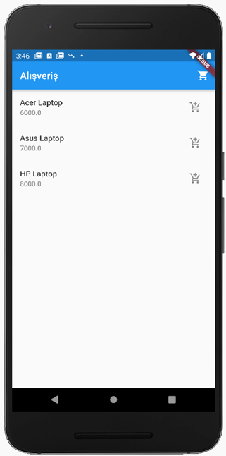
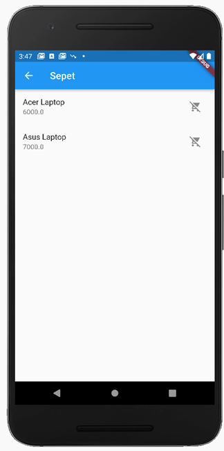

# flutter_bloc_sample

BLoC Örneği -

Kod çalıştığında, sepete ekleme düğmesine basılınca ekleme işlemi yapılıyor.
Sağ üstte yer alan sepet düğmesine tıklanınca sepet ekranına geçiliyor. Sepete eklenenler görünüyor.
Sepetten çıkarma düğmesine basılınca ise sepetten çıkıyorlar.

